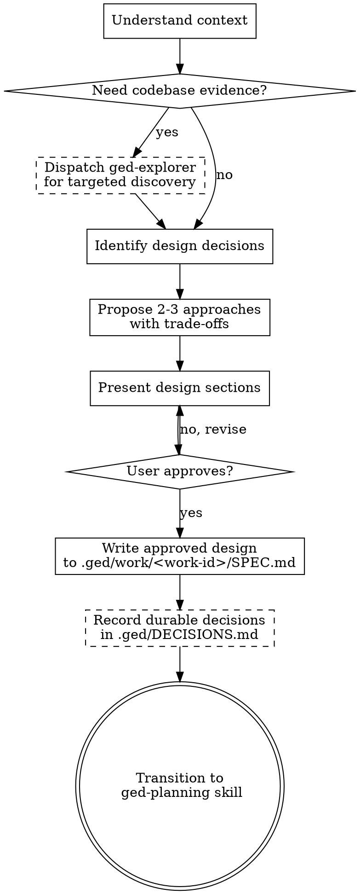

# Brainstorming: Design Exploration Before Planning

GedPi's pre-planning creative exploration phase. Use this skill **after** requirements are clear (via `grill-me` or the user's own specification) but **before** formal implementation planning (`ged-planning`).

## When to Use Brainstorming vs. Other Skills

| Phase | Skill | Purpose |
|---|---|---|
| Requirements clarity | `grill-me` | What needs to be built |
| **Design exploration** | **brainstorming** | **How to build it — approaches, architecture, trade-offs** |
| Implementation plan | `ged-planning` | Concrete task breakdown and verification plan |
| Execution | `ged-execution` | Do the next task |

Use brainstorming when the request involves:
- Choosing between multiple implementation approaches
- Architectural or structural decisions
- Component design, data model design, API design
- User experience or workflow design
- Any situation where the "how" isn't obvious and needs exploration

**Don't** use brainstorming when:
- The approach is already clear and just needs execution → go straight to `ged-planning`
- Requirements are unclear → use `grill-me` first

<HARD-GATE>
Do NOT invoke `ged-planning`, `ged-execution`, write any code, scaffold any project, or take any implementation action until the design is approved and recorded in `.ged/work/<work-id>/SPEC.md`.
</HARD-GATE>

## Checklist

Work through these in order:

1. **Understand current context** — read `.ged/PROJECT.md`, `.ged/ARCHITECTURE.md`, `.ged/DECISIONS.md`, and any existing `.ged/work/<work-id>/SPEC.md`. If live codebase context is needed, dispatch `ged-explorer` subagent for targeted discovery.
2. **Identify the design decisions to make** — what are the open questions? What needs user input before implementation can proceed?
3. **Propose 2-3 approaches** — with trade-offs and your recommendation. Scale depth to the complexity of the decision.
4. **Present design** — once the approach is settled, flesh out the design. Cover architecture, components, data flow, key interfaces.
5. **Get user approval** — confirm each section before moving on.
6. **Write design to SPEC.md** — record the approved design in `.ged/work/<work-id>/SPEC.md`.
7. **Promote durable decisions** — record any lasting architectural choices in `.ged/DECISIONS.md`.
8. **Transition to planning** — invoke `ged-planning` to break the design into implementation tasks.

## Process Flow



## The Process

### 1. Understand current context

Read the project's durable memory first:
- `.ged/PROJECT.md` — goals, constraints, success criteria
- `.ged/ARCHITECTURE.md` — current system shape
- `.ged/DECISIONS.md` — prior decisions that constrain this design
- `.ged/work/<work-id>/SPEC.md` — any existing spec for the current work item

If the design depends on understanding existing code (e.g., "what does the extension API look like?", "how is X currently implemented?"), dispatch `ged-explorer` as a background subagent:
```
Agent({ subagent_type: "ged-explorer", prompt: "Investigate how X works and what interfaces exist", description: "Explore codebase for design context", run_in_background: true })
```
Wait for the result before proposing approaches. Do not manually grep/find the codebase during the explore phase — let the explorer do it.

### 2. Identify the design decisions

Before jumping to solutions, list the open questions:
- What are the axes of choice?
- What's fixed vs. flexible?
- What constraints narrow the options?
- What risks should the design address?

If any of these are really requirement questions (not design questions), redirect to `grill-me` or check if the user already answered them.

### 3. Propose approaches

Present 2-3 different approaches with trade-offs. For each:
- What it is, at a high level
- Key trade-offs (complexity vs. flexibility, performance vs. clarity, etc.)
- How well it fits the project's existing patterns and constraints

Lead with your recommended option and explain why. If an approach is clearly wrong given the project's constraints, say so and explain.

Scale to the decision:
- **A simple component decision**: a few sentences per approach
- **An architectural choice**: a paragraph per approach with concrete implications
- **A complex system design**: a structured comparison (pros/cons/risks per approach)

### 4. Present the design

Once the approach is chosen, flesh out the design. Cover what matters for this decision:

- **Architecture** — how components relate, boundaries, data flow
- **Key interfaces** — APIs, events, data structures
- **Integration points** — how it connects to existing code
- **Error handling and edge cases** — what happens when things go wrong
- **Testing strategy** — how to verify it works

Scale each section to its complexity. A straightforward function might need a sentence; a new subsystem needs more. Present incrementally — ask the user to confirm each section before moving to the next.

**Design principles to apply:**
- **Isolation** — each unit has one clear purpose, communicates through well-defined interfaces, can be understood and tested independently
- **Signal over ceremony** — if a section is straightforward, keep it short. Don't pad.
- **YAGNI** — remove unnecessary features. If a question doesn't need to be answered now, defer it.
- **Patterns over novelty** — follow existing project conventions unless there's a reason not to
- **Targeted improvement** — if existing code has problems relevant to this design, include fixes. Don't propose unrelated refactoring.

### 5. Get user approval

Ask after each design section whether it looks right. Be ready to go back and revise.

This is the hard gate: no implementation before the design is approved.

### 6. Write the design to SPEC.md

Record the approved design in `.ged/work/<work-id>/SPEC.md`. The spec should be:

- **Concise but complete** — someone who reads it should understand what to build and why
- **Decision-focused** — capture what was decided and why alternatives were rejected
- **Implementation-referenced** — call out specific files, interfaces, and patterns

Structure:
```markdown
# SPEC: [Design Title]

## Goal
What problem does this solve?

## Approach
Which approach was chosen and why.

## Design
- Architecture / component breakdown
- Key interfaces and data flow
- Integration points
- Error handling / edge cases

## Open Questions
Anything deferred or still unresolved.

## Testing Strategy
How to verify the implementation.
```

### 7. Record durable decisions

If the design makes lasting architectural decisions that future work should respect, add them to `.ged/DECISIONS.md`:

```
- Date: YYYY-MM-DD
  - Decision: [the decision]
  - Why: [the rationale]
  - Impact: [what it means for future work]
```

### 8. Transition to planning

Once the design is approved and recorded:
> "Design approved and written to `.ged/work/<work-id>/SPEC.md`. Ready to break this into implementation tasks. Let me invoke `ged-planning` to create the task breakdown."

Then dispatch or invoke `ged-planning` to decompose the spec into `TASKS.md` and `TESTS.md`.

## Key Principles

- **One question at a time** — don't overwhelm with multiple design questions. Walk through systematically.
- **Approach first, details second** — settle on the "how" before diving into specifics.
- **Explore alternatives** — always consider at least 2 approaches before settling.
- **YAGNI ruthlessly** — if it's not needed for the current work item, leave it out.
- **Incremental validation** — present each section, get approval, move on.
- **Be flexible** — go back and revise when new information surfaces.
- **Design up to the point of confidence** — the spec should be clear enough to plan from, not a comprehensive implementation reference.
